# ぷらべぼっと！ -マニュアル-

## はじめに

プラベボットをダウンロードいただき、ありがとうございます。
このマニュアルは**Ver. 1.3.0**の内容のものとなります。

## インストール方法

ダウンロードいただいた「**purabebot Setup {バージョン情報}.exe**」を実行してください。
※ {バージョン情報} はインストールしたバージョンによって異なります。  

※以下の画面が表示される場合、「**実行**」を選択してください。  
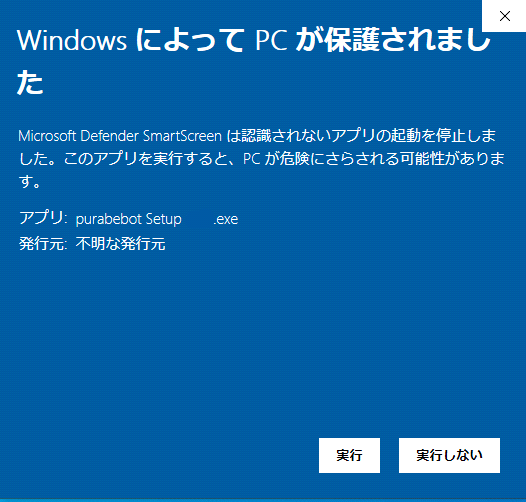

「**このコンピューターを使用しているすべてのユーザー用にインストールする**」を選択し、「**次へ**」を選択して下さい。  
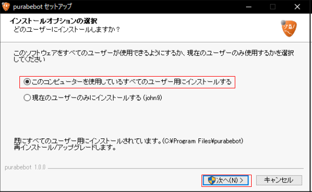

以下の画面が表示された場合、「**はい**」を選択してください。  
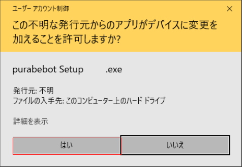

インストール先を入力し「**インストール**」をクリックしてください。（変更しないことを推奨します。）  
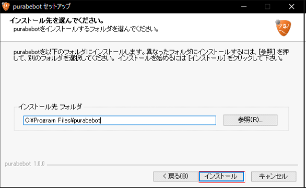

以下の画面が表示されましたら、インストール完了です。  
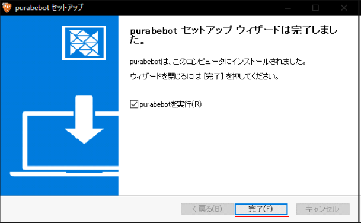

## 利用準備

### OBSでの利用準備

OBSのソースの追加を実施してください。

ソースの追加から「**ブラウザ**」を選択してください。  

わかりやすい名前でソースを追加します。
（例）プラベボット  
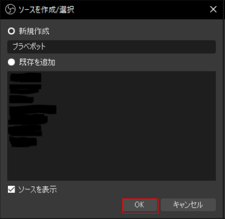

プロパティ内のURL、幅、高さを以下のように設定して「**OK**」をクリックしてください  
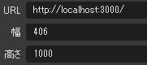

プロパティ

<table>
  <tr>
    <td>URL</td>
    <td>http://localhost:3000/</td>
    </tr>
  <tr>
    <td>幅</td>
    <td>406</td>
    </tr>
  <tr>
    <td>高さ</td>
    <td>1000</td>
    </tr>
</table>

あとは任意の位置やサイズに変更してご利用ください。

## 利用方法

本アプリではご自身で作成されたTwitchのbotアカウントも利用できます。
「**使用する配信チャンネル名**」と「**自分のチャンネル名 or 作成したボットのチャンネル名**」が同一でも問題ありません。
「**Twitch Chat OAuth Password**」につきましては、トークンを未取得の場合、右下の「**トークンの取得**」
または、[**こちら**](https://twitchapps.com/tmi/)からトークンを取得してください。

記入内容

<table>
  <tr>
    <td>使用する配信チャンネル名</td>
    <td>ご自身の配信チャンネル名（URLのID部分）</td>
  </tr>
  <tr>
    <td>自分のチャンネル名 or 作成したボットのチャンネル名</td>
    <td>botをお持ちの方はbotのアカウント名</td>
  </tr>
  <tr>
    <td>Twitch Chat OAuth Password</td>
    <td>ボット or 自身のチャンネルのトークン</td>
  </tr>
</table>

入力が完了しましたら「**接続**」ボタンをクリックしてください。  

接続後、以下の画面が表示される場合は、「**アクセスを許可する**」を選択してください。  
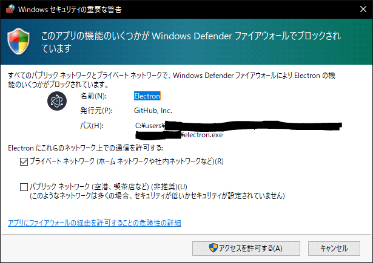

接続に成功すると以下の画面が表示されます。  
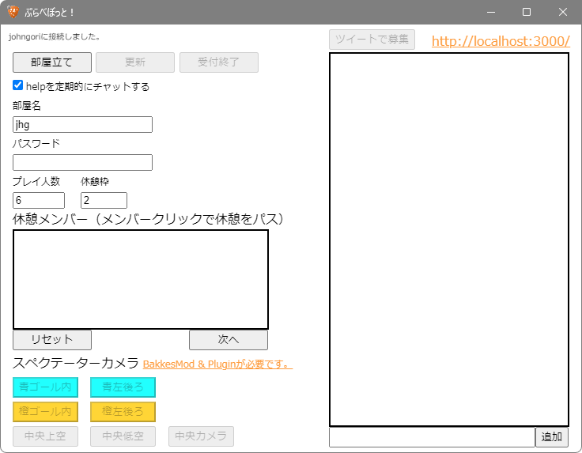

### 部屋立て

記入欄に部屋の必要な情報を設定しましたら「**部屋立て**」を選択してください。  
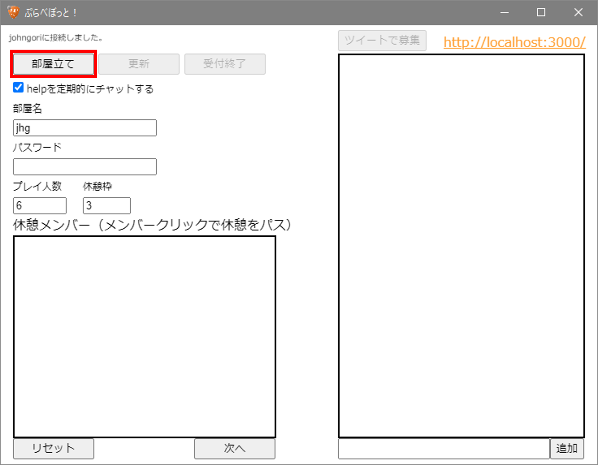

記入例

<table>
  <tr>
    <td>必須：部屋名</td>
    <td>ご自身がプラベで利用する部屋名を記入してください。</td>
  </tr>
  <tr>
    <td>省略可：パスワード</td>
    <td>プラベで利用するパスワードを記入してください。</td>
  </tr>
  <tr>
    <td>必須：プレイ人数</td>
    <td>プラベのプレイ人数を設定してください。（1～10人）</td>
  </tr>
  <tr>
    <td>必須：休憩枠</td>
    <td>プラベの休憩枠の人数を設定してください。（0～5人）</td>
  </tr>
</table>

本アプリ左上部に「**受付を開始しました！**」と表示されていましたら、作成が完了しています。
右上部のURLをクリックし、内容をご確認ください。  
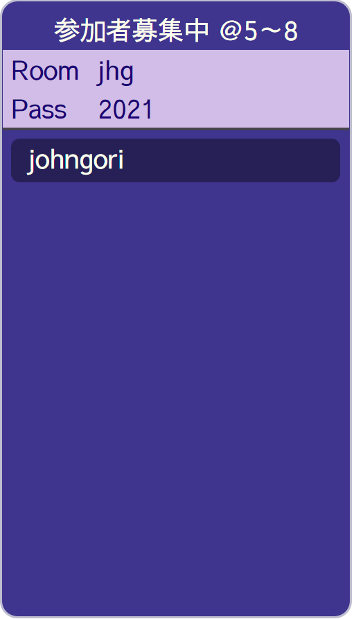

※OBSで確認する場合は、作成したブラウザソースを**再読み込み**する必要があります。

### 参加募集

#### ・参加希望者側から参加

参加希望者側から参加はTwitchのチャット内で
参加希望者側が「**!join**」または「**!j**」と入力すると、参加が可能です。  
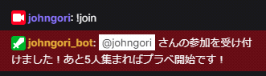

#### ・配信者またはモデレータが参加者を追加

本アプリの右下部の記入欄に参加希望者名を入力後、「**追加**」ボタンをクリックすると、追加いただけます。  
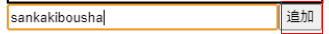  
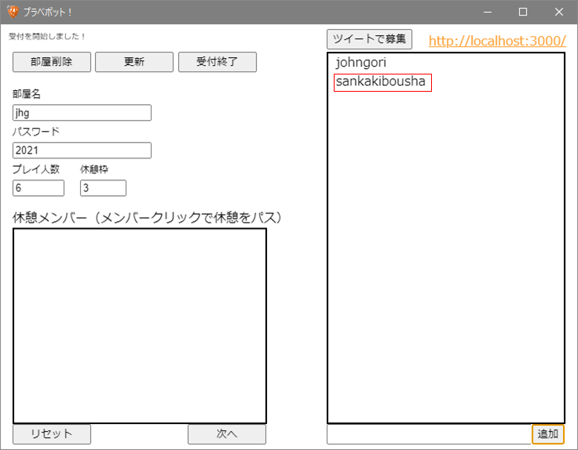

または、配信のチャットで「**!add {参加希望者名}**」と入力すると、追加いただけます。  
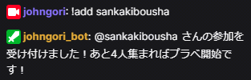

### 参加取消

#### ・参加者側から参加取消

参加者からチャットにて「**!leave**」または「**!l**」と入力していただくと、参加取消が可能です。  
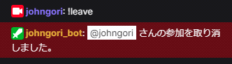

#### ・配信者またはモデレータから参加取消

本アプリ右部の参加者リストの取消を行う参加者名で**左クリック**すると参加取消が行えます。  

または配信のチャットで「**!remove 参加者名**」と入力すると、参加取消が行えます。  
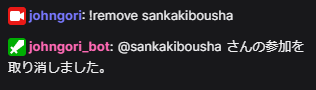

### 休憩の設定

本アプリは自動で休憩者を選択しています。
休憩者が必要な人数に達した際に、「**リセット**」または、「**次へ**」ボタンをクリックしてください。

本アプリ左下部の休憩メンバー内が休憩者となります。
休憩をパスしたい場合はパスしたい休憩者を**左クリック**してください。  
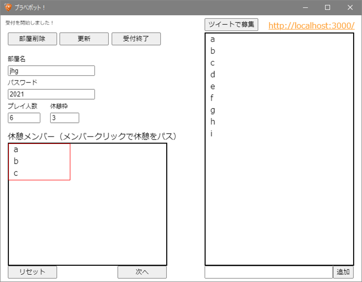

「**次へ**」をクリックすると、次の休憩メンバーが表示されます。  
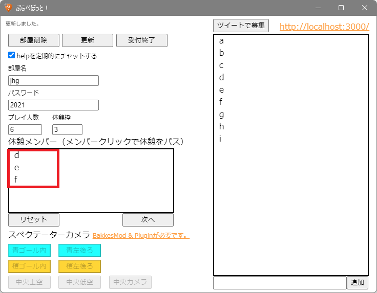

### 受付終了 / 受付再開

「**受付終了**」ボタンをクリックすると、参加募集を終了し、受付不可となります。
参加は不可となりますが、すでに参加している参加者は表示されます。  
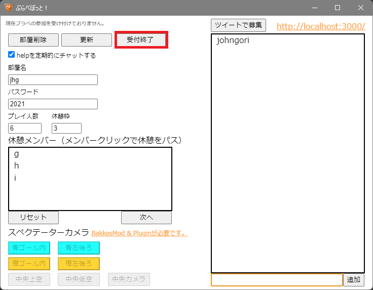

※「**受付終了**」ボタンをクリック後、同じ位置にある「**受付再開**」ボタンをクリックすると、再度受付を再開します。

### 更新

部屋立て後、参加者を変更せずに部屋の情報を変更したい場合、
必要な部屋の情報に修正した後、本アプリの左上部にある「更新」ボタンをクリックしてください。  
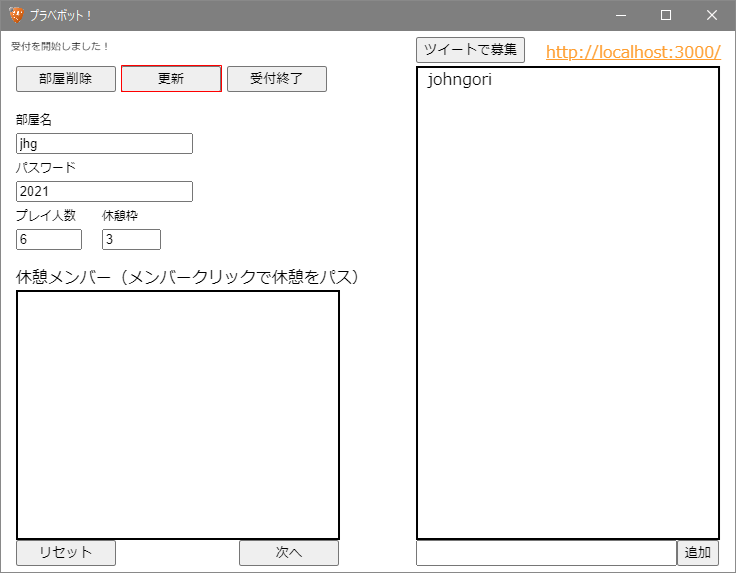

### 部屋削除

部屋立て後、本アプリの左上部の「部屋削除」ボタンをクリックすると、
参加者を含む作成した部屋の情報を削除できます。  
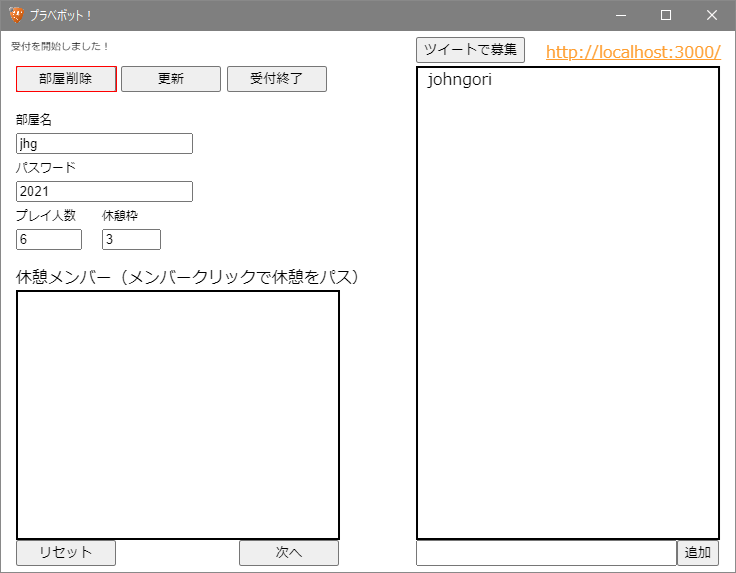

### ツイートで募集

部屋立て後、本アプリの右上部の「ツイートで募集」ボタンをクリックすると、
ツイートで募集を行えます。  
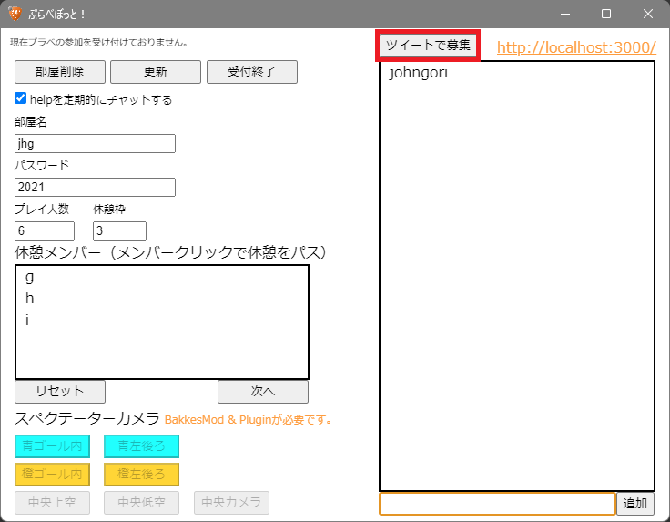  
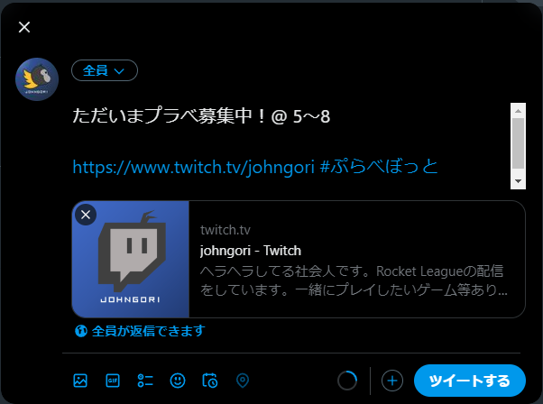

### スペクテーターカメラ

詳細についてはノートにまとめておりますのでご確認ください。
[ぷらべぼっと！スペクテーターカメラについて](https://note.com/johngori/n/ne7dcd4773534)

## 連絡先

