# ぷらべぼっと！ -マニュアル-

## はじめに

プラベボットをダウンロードいただき、ありがとうございます。
このマニュアルは最新バージョンの内容のものとなります。

## インストール方法
インストーラは[こちら](https://github.com/johngori/purabebot/releases/download/2.0.0/purabebot.Setup.2.0.1.exe)からダウンロードしてください。

ダウンロードいただいたインストーラー（exeファイル）を実行してください。
※以下の画面が表示される場合、「**実行**」を選択してください。  
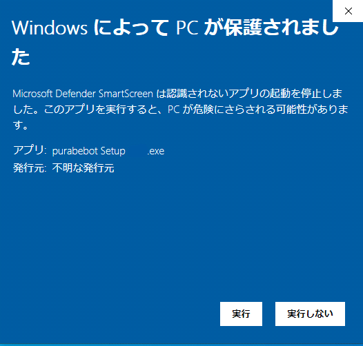

指示に従ってインストールを進めてください。インストールが完了するとアプリが自動的に起動します。

## メニューバーの機能について

新バージョンより画面上部のメニューバーに各種設定がまとまりました。

- **ファイル**
  - **ブラウザソースのURLをコピー**: OBSに設定するためのローカルURLをクリップボードにコピーします。
  - **終了**: アプリを終了します。
- **プロフィール**
  - **サインアウト**: 現在ログインしているTwitchアカウントからサインアウトします。
  - **自身のTwitchページへ**: 既定のブラウザでご自身のTwitchチャンネルページを開きます。
- **設定**
  - **言語**: 日本語/Englishの切り替えが可能です。
  - **helpを定期的にチャットする**: チェックを入れると定期的に参加方法の案内をチャットに送信します。
  - **詳細設定**: 
    - **文言設定**: アプリやブラウザソース上に表示されるメッセージ、チャットへ送信されるメッセージを自由にカスタマイズできます。
    - **ポート設定**: ローカルサーバーのポート番号を変更できます。（OBSに複数表示させたい場合などに利用します）

## OBSでの利用準備

OBSのソースの追加から「**ブラウザ**」を選択してください。  
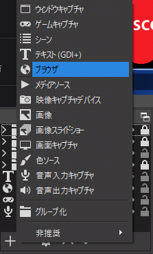

わかりやすい名前でソースを追加します。
（例）プラベボット  
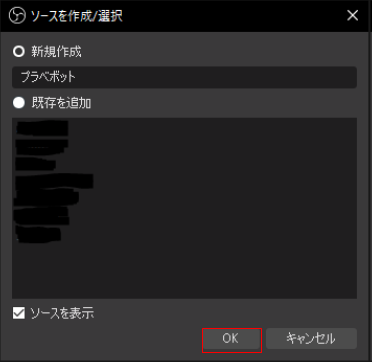

プロパティ内のURLに、本アプリのメニューから「**ファイル > ブラウザソースのURLをコピー**」でコピーしたURLを貼り付けます。
幅と高さを以下のように設定して「**OK**」をクリックしてください。

<table>
  <tr>
    <td>URL</td>
    <td>コピーしたURL（例: http://localhost:3000/）を貼り付け</td>
  </tr>
  <tr>
    <td>幅</td>
    <td>406</td>
  </tr>
  <tr>
    <td>高さ</td>
    <td>1000</td>
  </tr>
</table>

あとは任意の位置やサイズに変更してご利用ください。

## ログイン（利用方法）

本アプリを起動し、中央の「**Twitchでログイン**」ボタンをクリックしてください。
ブラウザが自動的に開き、Twitchの認証画面が表示されます。
「**アクセスを許可する**」を選択してください。

認証に成功すると自動的にアプリ画面がメインの部屋立て画面（ダークテーマUI）に切り替わります。
※ご自身のアカウントでログインするだけで準備は完了です。

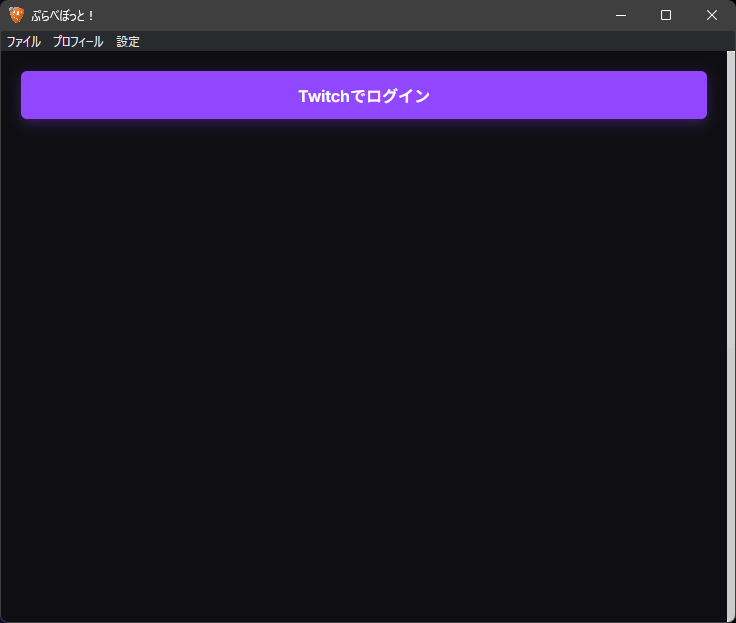
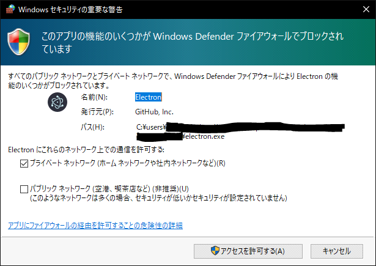
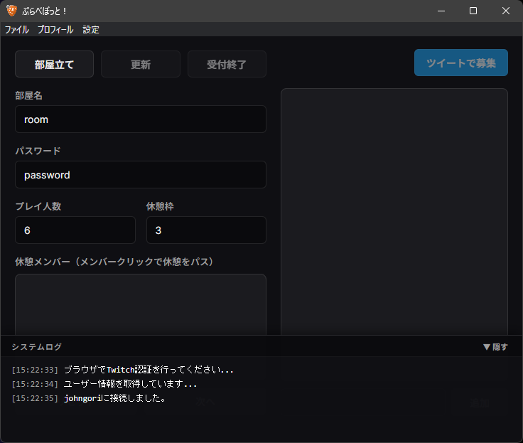

## 部屋立て

必要な情報を設定しましたら「**部屋立て**」を選択してください。

記入例

<table>
  <tr>
    <td>必須：部屋名</td>
    <td>ご自身がプラベで利用する部屋名を記入してください。</td>
  </tr>
  <tr>
    <td>省略可：パスワード</td>
    <td>プラベで利用するパスワードを記入してください。</td>
  </tr>
  <tr>
    <td>必須：プレイ人数</td>
    <td>プラベのプレイ人数を設定してください。（1～10人）</td>
  </tr>
  <tr>
    <td>必須：休憩枠</td>
    <td>プラベの休憩枠の人数を設定してください。（0～5人）</td>
  </tr>
</table>

システムログに「**受付を開始しました！**」と表示されていましたら、作成が完了しています。
OBS上でブラウザソースが正しく表示されることを確認してください。
（※表示されない場合はOBSのブラウザソースのプロパティから「再読み込み」をお試しください。）

## 参加募集

### ・参加希望者側から参加
Twitchのチャット内で参加希望者が「**!join**」または「**!j**」と入力すると、参加が可能です。  
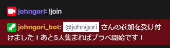

### ・配信者またはモデレータが参加者を追加
本アプリの左下にある追加欄に参加希望者名を入力後、「**追加**」ボタンをクリックすると、手動で追加できます。  
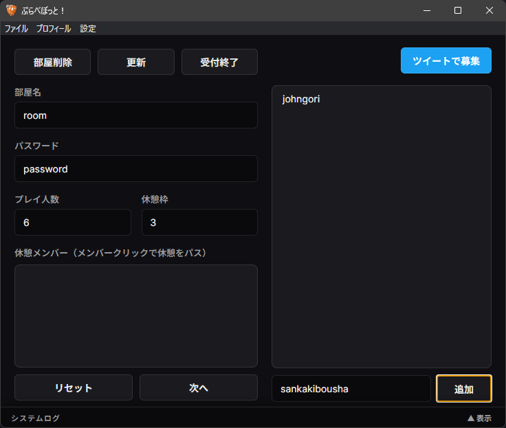

または、配信のチャットで「**!add {参加希望者名}**」と入力すると、追加いただけます。  
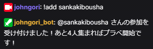

## 参加取消

### ・参加者側から参加取消
参加者からチャットにて「**!leave**」または「**!l**」と入力していただくと、参加取消が可能です。  
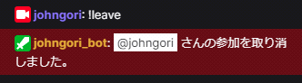

### ・配信者またはモデレータから参加取消
本アプリ右部の参加者リストで、取消を行いたい参加者名を**左クリック**すると参加取消が行えます。  
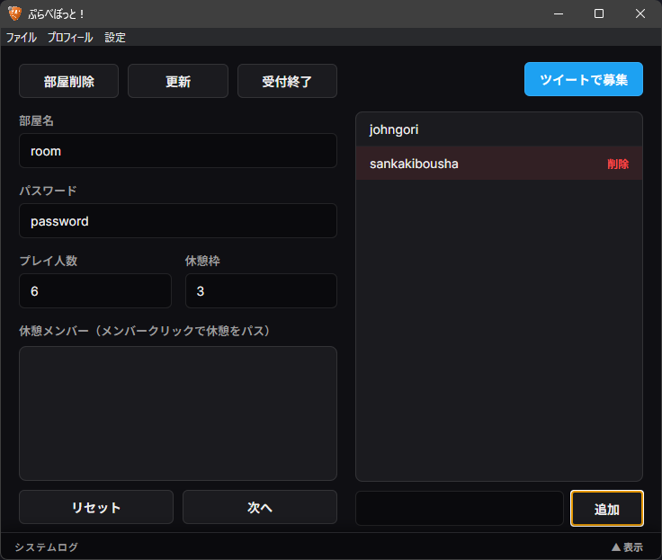

または配信のチャットで「**!remove 参加者名**」と入力すると、参加取消が行えます。  
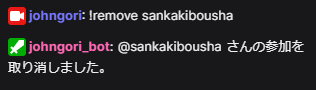

## 休憩の設定

本アプリは自動で休憩者を選択しています。
休憩者が必要な人数に達した際に、「**リセット**」または、「**次へ**」ボタンをクリックしてください。

本アプリの「休憩メンバー」欄に表示されているユーザーが休憩者となります。
休憩をパスしたい場合はパスしたい休憩者を**左クリック**してください。  

「**次へ**」をクリックすると、次の休憩メンバーに切り替わります。  
または配信のチャットで「**!qk**」と入力すると、同様に次の休憩メンバーが表示されます。

## 受付終了 / 受付再開

「**受付終了**」ボタンをクリックすると、参加募集を終了し、受付不可となります。
参加は不可となりますが、すでに参加している参加者は表示されます。  
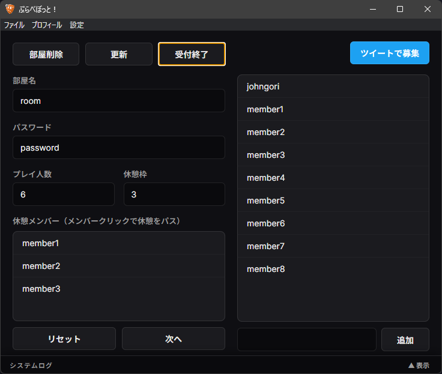

※「**受付終了**」ボタンをクリック後、同じ位置にある「**受付再開**」ボタンをクリックすると、再度受付を再開します。

## 更新

部屋立て後、参加者を変更せずに部屋の情報を変更したい場合、
必要な部屋の情報に修正した後、本アプリの上部にある「**更新**」ボタンをクリックしてください。

## 部屋削除

部屋立て後、本アプリの「**部屋削除**」ボタンをクリックすると、
参加者を含む作成した部屋の情報をすべて削除し、初期状態に戻すことができます。

## ツイートで募集

部屋立て後、本アプリの右上部の「**ツイートで募集**」ボタンをクリックすると、
ご自身のTwitter(X)が開き、現在の募集状況を含んだツイートを簡単に作成できます。  
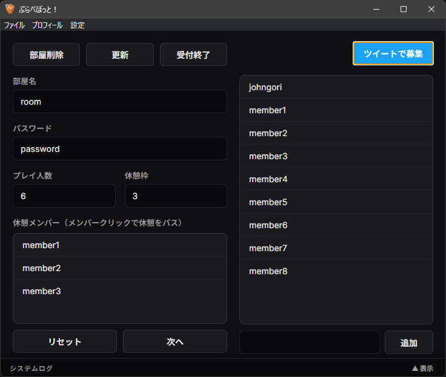

## 連絡先

